# Práticas de GitOps com ArgoCD
* Esse estudo consiste em utilizar o ArgoCD para atualizar um cluster Kubernetes conforme um repositório Git for atualizado.
* Para esse estudo será utilizado o projeto [microservices-demo](https://github.com/GoogleCloudPlatform/microservices-demo).
* Do projeto citado, o arquivo `kubernetes-manifests.yaml` localizado em `releases` foi copiado para este repositório [aqui](https://github.com/PedroMak/GitOpsStudyWithArgoCD/blob/master/boutique.yaml).
#
# Instalando o ArgoCD:
#### Para a instalação iremos seguir a [documentação oficial](https://argo-cd.readthedocs.io/en/stable/getting_started/) do ArgoCD, para isso é necessário já ter a ferramenta de linha de comando `kubectl` instalada e funcional em sua máquina.
* Com isso, primeiro criamos um `namespace` para o ArgoCD e realizamos sua instalação com o seguinte comando:
```
kubectl create namespace argocd

kubectl apply -n argocd -f https://raw.githubusercontent.com/argoproj/argo-cd/stable/manifests/install.yaml
```
* Em seguida, se rodarmos o comando `kubectl get pods -n argocd` iremos obter uma saída como a mostrada abaixo:

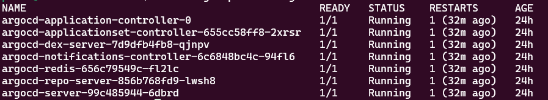
* Já com o comando `kubectl get svc -n argocd` iremos obter a seguinte saída:

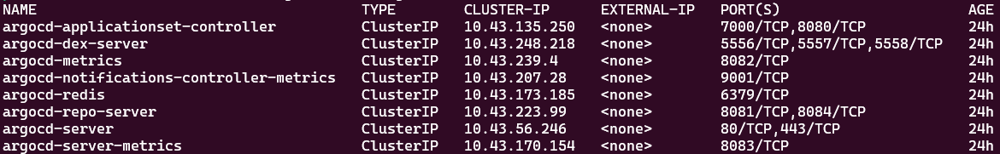
# Instalando o ArgoCD CLI:
* Neste estudo não fiz uso da CLI do ArgoCD para configuração e criação de um app, mas é interessante realizar sua instalação para algumas visualizações e para caso necessário.
* Como estou em meu subsystem Ubuntu, para instalar utilizei o seguinte comando:

```
curl -sSL -o argocd-linux-amd64 https://github.com/argoproj/argo-cd/releases/latest/download/argocd-linux-amd64

sudo install -m 555 argocd-linux-amd64 /usr/local/bin/argocd

rm argocd-linux-amd64
```
* Após a instalação podemos rodar `argocd version` para conferir sua versão.

# Acessando o ArgoCD:
* Iremos acessar o ArgoCD via `port-forward`, para isso, com o comando `kubectl get svc -n argocd` podemos localizar o serviço chamado `argocd-server`;
* Em seguida rodamos o comando `kubectl port-forward svc/argocd-server -n argocd 8080:443` para que possamos acessá-lo no `localhost:8080`:

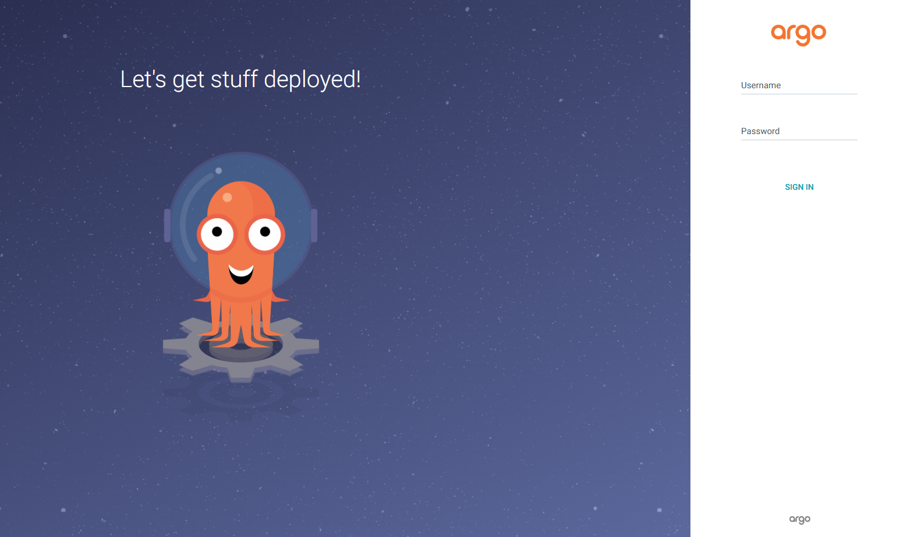

* Para realizar o login, por default, o username é `admin`, já a senha é um campo condificado em base64 em um `secret` chamado `argocd-initial-admin-secret`. Para obter a senha decodificada utilizamos o seguinte comando:

```
kubectl get secret argocd-initial-admin-secret -n argocd -o jsonpath="{.data.password}" | base64 -d
```
> [!NOTE]
> Caso a senha decodificada venha com um `%` no final, ele pode ser descartado.

* Agora com o username e com a senha, podemos logar tanto na UI quanto na CLI;
* Para logar na CLI utiliza-se o comando `argocd login <ARGOCD_SERVER>`, que no nosso caso será `argocd login localhost:8080`;
* Logado na CLI, podemos rodar `argocd cluster list` para verificar quais clusters o ArgoCD estará monitorando, que no nosso caso é apenas nosso cluster local:

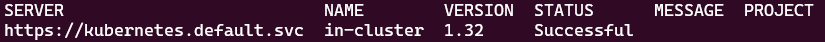

* Após o login, recomenda-se atualizar a senha, pelo UI, clique em `User Info` e depois em `UPDATE PASSWORD`.

# Criando a aplicação:
* A aplicação é o que irá dizer para o ArgoCD qual repositório ele deve observar e em qual cluster ele deve aplicar as alterações feitas nesse repositório. 
* Pode ser criada via linha de comando ou com um arquivo `.yaml`. Como boa prática de GitOps, criei um arquivo de configuração `.yaml` que está [aqui](https://github.com/PedroMak/GitOpsStudyWithArgoCD/blob/master/application.yaml).
* As partes chave desse arquivo são `source` e `destination`:
  * Em `source` nós especificamos o link do repositório que o ArgoCD irá observado, qual commit será aplicado e o caminho dentro do repositório que será observado;
  * Em `destination` nós especificamos o cluster e o namespace onde as alterações serão aplicadas;
* Uma parte interessante também é o `syncPolicy`, onde ativamos o autotratamento, e a exclusão automática de objetos deprecados, que por padrão, vem desativados.

> [!NOTE]
> Essa ativação pode ser feita pela UI do ArgoCD, mas como boa prática, especifiquei no arquivo de configuração.

* Após a criação do arquivo, nós fazemos o upload dele e do manifesto do microservices-demo para o nosso repositório.
* Em seguida, em nosso terminal, dentro do diretório onde ele se encontra, nós rodamos o comando `kubectl apply -f application.yaml`.

# Visualizando o funcionamento:
* Após a criação de nossa aplicação, podemos rodar o comando `kubectl get all -n default` para visualizar a criação dos componentes da aplicação `microservices-demo`:
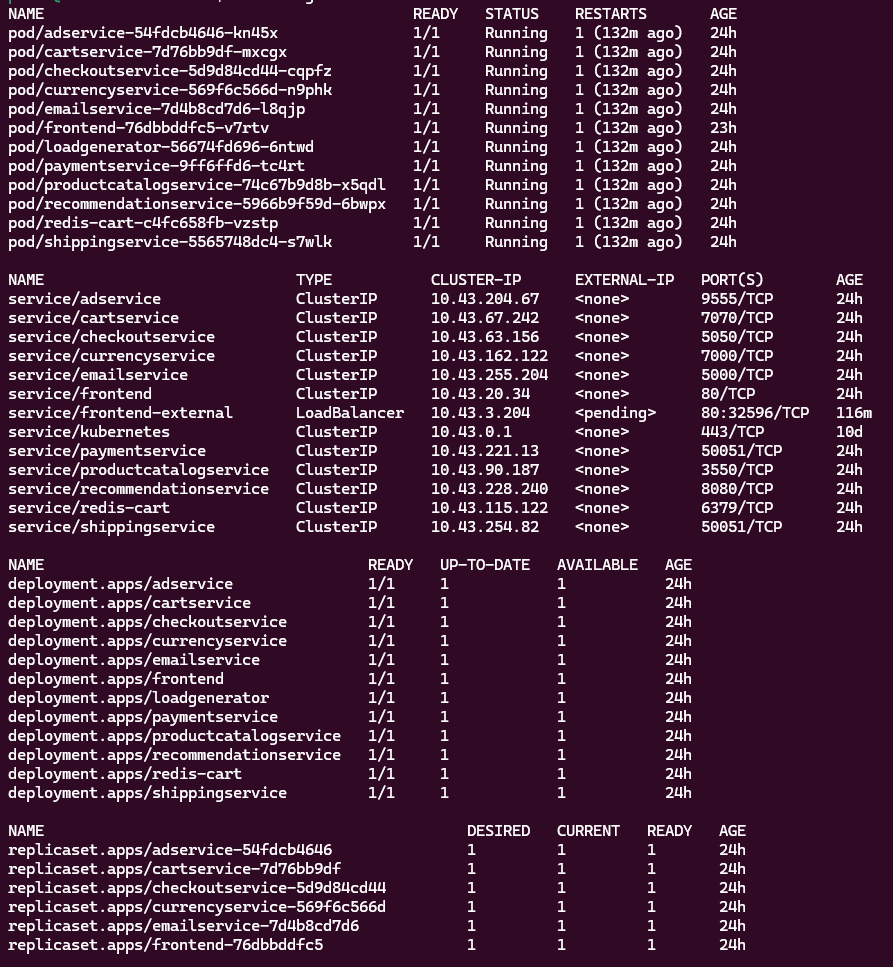

* Na UI do ArgoCD conseguimos também visualizar a aplicação criada:
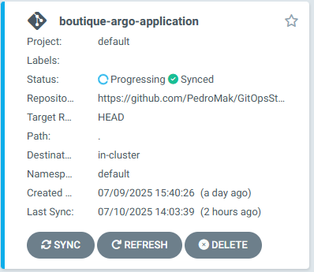

* A aplicação `microservices-demo` possui um serviço do tipo Load Balancer, que, como não está sendo utilizado por nós neste momento, fica em estado de `pending`, e por isso, a aplicação fica eternamente em estado de `Progressing` ao invés de `Healthy`;
* Para resolver isso, comentar ou deletar a declaração desse serviço em nosso manifesto:
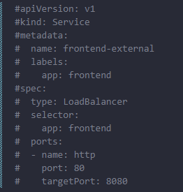

* Após aguardar alguns minutos (por padrão o ArgoCD olha o repositório a cada 3 minutos) iremos observar que o serviço de Load Balancer foi excluído e a aplicação agora se encontra como `Healthy`:
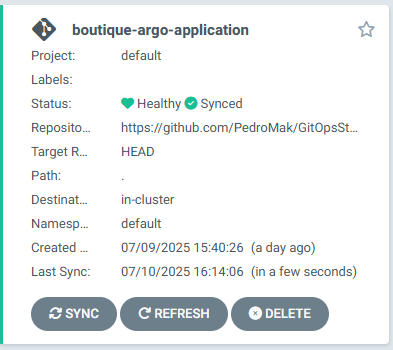

* Podemos acessar o conteúdo da aplicação `microservices-demo` via `port-forward` no serviço de frontend com o seguinte comando:

```
kubectl port-forward svc/frontend 3000:80
```
* Em seguida, no navegador, acessamos `localhost:3000`
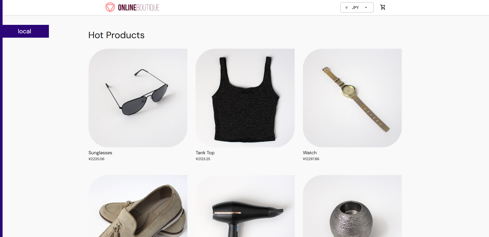

# Teste adicional:

* No momento a aplicação `microservices-demo` possui apenas um `pod frontend`:
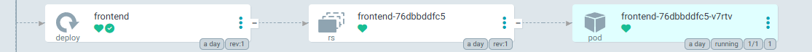

* No [boutique.yaml](https://github.com/PedroMak/GitOpsStudyWithArgoCD/blob/master/boutique.yaml), no `Deployment` do serviço de frontend, adicionei 3 replicas:
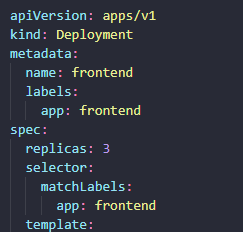

* Após realizar o `push` dessa mudança e aguardar alguns minutos, a aplicação foi atualizada e agora possui 3 pods frontend:
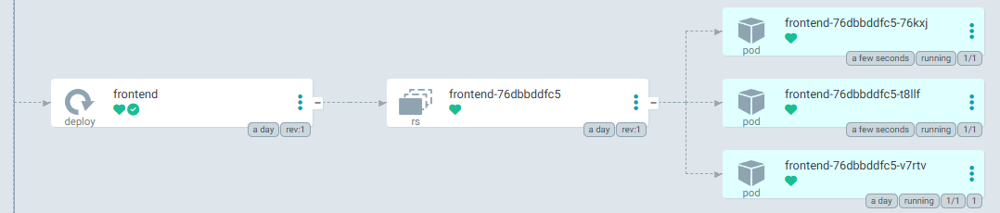